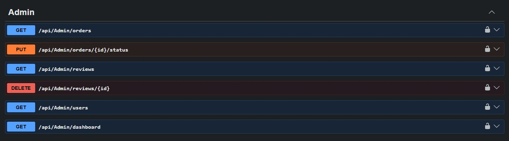
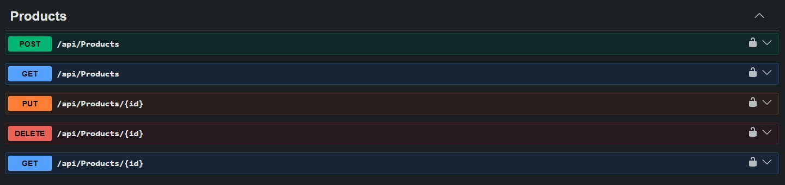
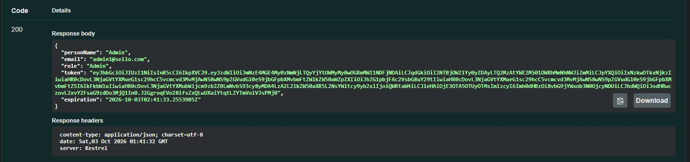

# Sello - E-Commerce Backend API

## Overview

Sello is a RESTful e-commerce backend API built with ASP.NET Core.
It provides the core backend functionality required for an online store,
including authentication, product and category management, shopping carts,
checkout, orders, shipping addresses, reviews, and administrative operations.
The project follows Clean Architecture principles to achieve clear separation
of concerns, maintainability, and a scalable backend structure.


## Features

- JWT Authentication & Role-Based Authorization
- Customer and Admin roles
- Product and Category management
- Product search, filtering, sorting, and pagination
- Shopping cart management with stock validation
- Shipping address management
- Checkout and order management
- Order history and order details
- Order status management
- Product reviews and rating aggregation
- Admin review moderation
- User management
- Admin dashboard statistics
- FluentValidation
- Global Exception Handling
- Database transactions
- Swagger / OpenAPI documentation


## Tech Stack

- C#
- ASP.NET Core Web API
- Entity Framework Core
- SQL Server
- ASP.NET Core Identity
- JWT Bearer Authentication
- AutoMapper
- FluentValidation
- Swagger / OpenAPI
- LINQ
- Git & GitHub


## Architecture

Sello follows Clean Architecture principles with a clear separation of
concerns between the API, Application, Domain, and Infrastructure layers.

```text
SelloSolution
│
├── Sello
│   └── API / Presentation
│
├── Sello.Application
│   └── Services, DTOs, Validators, Mappings
│
├── Sello.Domain
│   └── Entities, Enums, Repository Contracts
│
└── Sello.Infrastructure
    └── EF Core, DbContext, Repositories


## Authentication & Authorization

Sello uses ASP.NET Core Identity for user and role management
and JWT Bearer Authentication for securing API endpoints.

The application supports two main roles:

- **Customer** — shopping, checkout, orders, addresses, and reviews
- **Admin** — product/category management, user management, order management,
  review moderation, and dashboard statistics


## Checkout & Orders

The checkout process validates the user's cart, shipping address,
and product stock before creating an order.

A database transaction is used to keep the checkout operation consistent.
Order data also stores snapshots of shipping information and product details,
such as product name and unit price, to preserve historical order data.


## Validation & Error Handling

Request validation is handled using FluentValidation.

Global exception handling is implemented using ASP.NET Core's
`IExceptionHandler` with custom exceptions:

- `NotFoundException` → 404
- `ForbiddenException` → 403
- `BadRequestException` → 400

Unexpected exceptions are handled centrally and return a safe generic
response without exposing internal implementation details.


## How to Run on Your PC

### Prerequisites

- .NET SDK
- SQL Server
- Visual Studio

### Setup

1. Clone the repository.
2. Open `SelloSolution.slnx` in Visual Studio.
3. Configure the SQL Server connection string in `appsettings.json`.
4. Configure the JWT settings.
5. Apply the Entity Framework Core migrations.
6. Build and run the application.

The API can then be accessed through the configured Swagger URL.

> **Note:** `appsettings.json` is excluded from source control. Create and configure
> your local version before running the application.


## API Documentation

The project includes Swagger / OpenAPI documentation for exploring and testing
the available API endpoints.

Swagger provides an interactive interface for sending requests and viewing
API responses directly from the browser.


## Swagger Screenshots

### Swagger Overview



### JWT Authentication



### Products API

